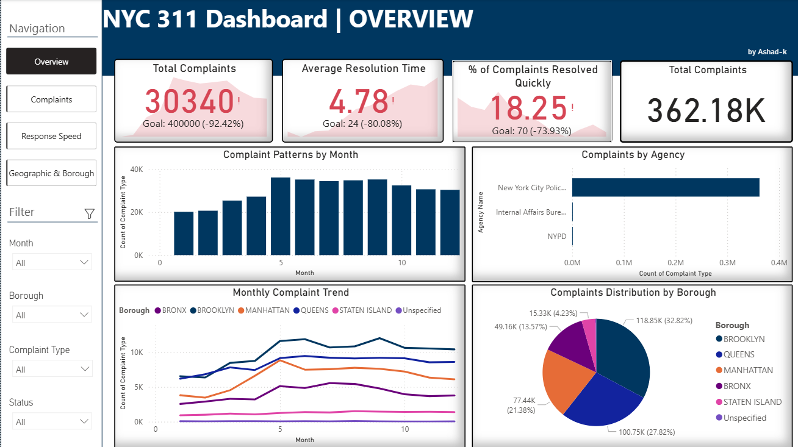
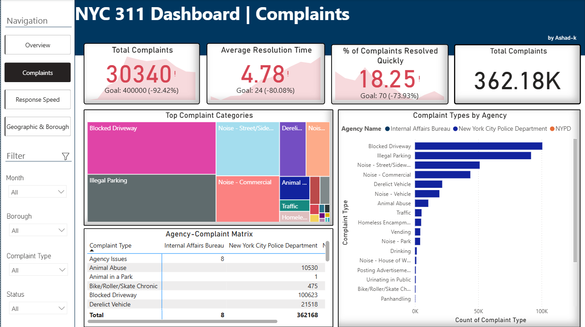
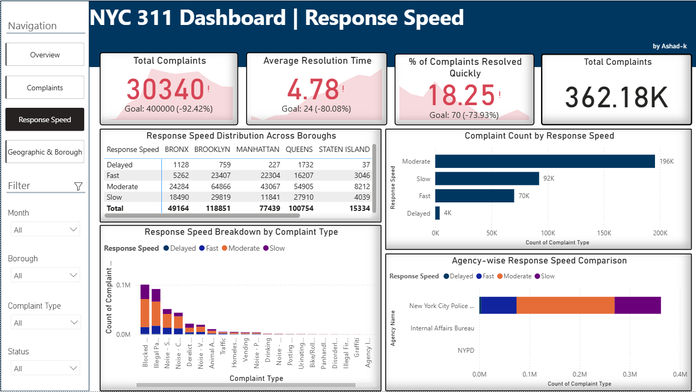
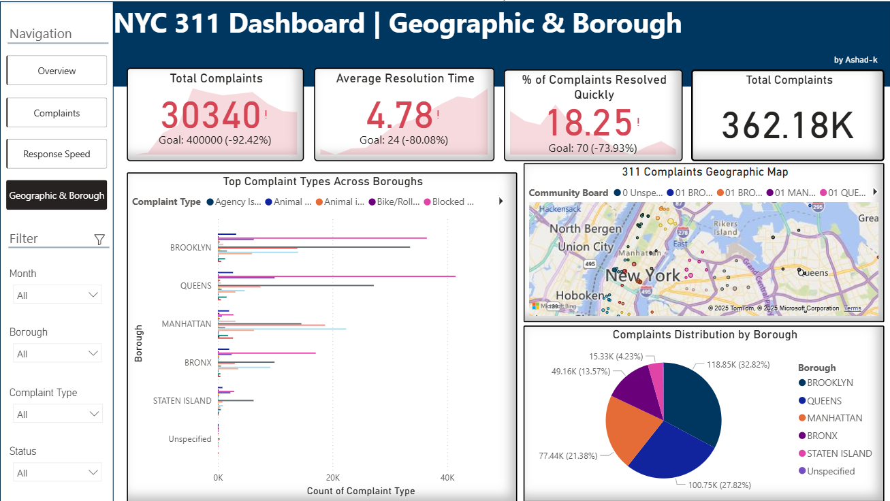

# 🗂️ 311 NYC Complaints Analysis Dashboard

This project focuses on analyzing 311 service complaint data from New York City to understand public grievances, response times, and service agency performance. The goal is to extract insights using Python for data cleaning and Power BI for interactive visualization.

---

## ⚙️ About the Project

- 📌 **Data Cleaning**: Used Python (Pandas) to clean and preprocess multiple raw CSV files for consistency and clarity.
- 📌 **Visualization**: Built an interactive Power BI dashboard with 4 detailed report pages.
- 📌 **Objective**: To analyze complaint types, agency involvement, geographic distribution, and response speed categories.

---

## 📊 Dashboard Pages

### ✅ Page 1 – KPI Overview & General Stats

### 🔍 Page 2 – Complaints by Type, Agency & Borough

### ⏱️ Page 3 – Response Speed Distribution

### 🗺️ Page 4 – Complaint Time Trend & Heatmap

> _Note: All visuals are interactive and filterable in Power BI._

---

## 📁 Data Sources

- `Complaints_by_Agency.csv`
- `Complaints_by_Borough.csv`
- `Complaints_by_Type.csv`
- `Response_Speed_Distribution.csv`
- `Cleaned_311_Complaints.csv` *(final dataset used in Power BI)*

---

## 💡 Key Features

- 🚀 Cleaned and merged data using Python
- 📊 Built 4 Power BI report pages with slicers, filters, heatmaps, bar charts, and KPIs
- 🔎 Enabled intuitive filtering by complaint type, borough, and speed
- 📈 Focused on response speed categories (Fast, Moderate, Slow)

---

## 👨‍💻 About Me

I'm Ashad K, a passionate Data Analyst & aspiring AI Engineer actively seeking opportunities in **Data Science**, **Machine Learning**, or **Data Analytics** roles — especially in the **UAE**.

---

## 📬 Let's Connect

- GitHub: [Ashad777](https://github.com/Ashad777)
- LinkedIn: [ashad-k](https://linkedin.com/in/ashad-k)
